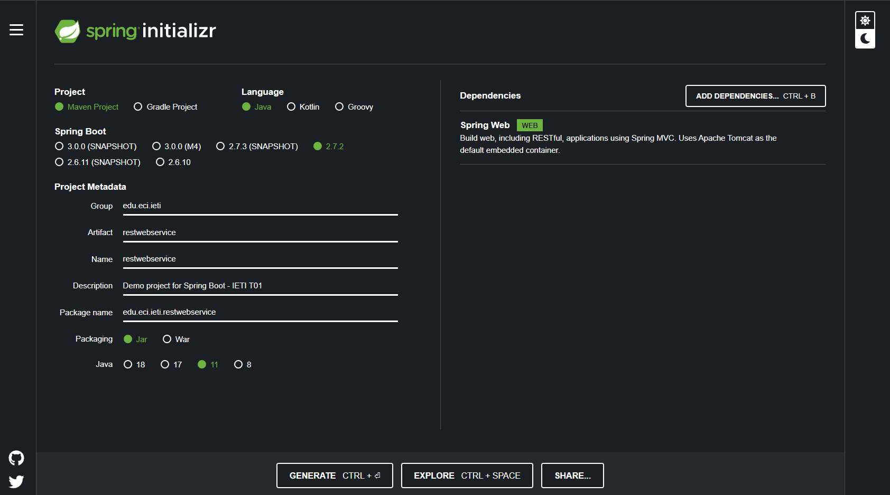

# Building a RESTful Web Service


In this practice is created a RESTful web service "Hello, World" with Spring.


## Development

The steps described in the following tutorial were implemented:

[Getting Started | Building a RESTful Web Service](https://spring.io/guides/gs/spring-boot/)


1. **Starting with Spring Initializr:** The initial project is created using the Spring initializer. The project is downloaded and unzipped to start.



2. **Create a Resource Representation Class. Create a Resource Controller:**
 The main class is created to instantiate a greeting and the controller that allows a GET request to obtain a greeting object in JSON format.


### Greeting class

  ```java
    package edu.eci.ieti.restwebservice;
    /**
    * Represents a greeting element.
    */
    public class Greeting {

        private final long id;
        private final String content;

        public Greeting(long id, String content) {
            this.id = id;
            this.content = content;
        }

        public long getId() {
            return id;
        }

        public String getContent() {
            return content;
        }
    }
  ```

### Controller class
  ```java
    package edu.eci.ieti.restwebservice;

    import java.util.concurrent.atomic.AtomicLong;

    import org.springframework.web.bind.annotation.GetMapping;
    import org.springframework.web.bind.annotation.RequestParam;
    import org.springframework.web.bind.annotation.RestController;

    @RestController
    public class GreetingController {

        private static final String template = "Hello, %s!";
        private final AtomicLong counter = new AtomicLong();

        @GetMapping("/greeting")
        public Greeting greeting(@RequestParam(value = "name", defaultValue = "World") String name) {
            return new Greeting(counter.incrementAndGet(), String.format(template, name));
        }
    }
  ```

### Prerequisites


* [Maven](https://maven.apache.org/) - Management tool used for projects build, dependency and documentation. 
* [Java ](https://www.oracle.com/co/java/technologies/javase/javase-jdk8-downloads.html)     - Programming language and computing platform.


### Installing

To download the project run:

  ```bash
    git clone https://github.com/ZulyVargas/RESTful-Web-Service-with-Spring.git
  ```

Run in RESTful-Web-Service-with-Spring/restwebservice:

```bash
    mvn clean install
    mvn run spring-boot:run
```


## Running the tests

1. Visit http://localhost:8080/greeting:


2. Visit http://localhost:8080/greeting?name=User with the user name of your choice:


## Built With

* [IntelliJ IDEA](https://www.jetbrains.com/help/idea/discover-intellij-idea.html) - Integrated development environment written in Java for developing computer software.
* [Maven](https://maven.apache.org/) - Dependency Management.
* [Java ](https://www.oracle.com/co/java/technologies/javase/javase-jdk8-downloads.html)     - Programming language and computing platform.


## Authors

* **Zuly Valentina Vargas Ramírez** 
